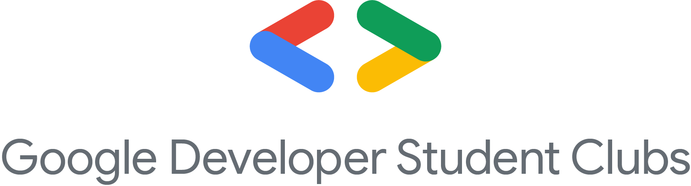

<h1>DSC-Resource-Center</h1>

----

<!-- ALL-CONTRIBUTORS-BADGE:START - Do not remove or modify this section -->

<!-- ALL-CONTRIBUTORS-BADGE:END -->

---

  

## Project Description

This open-source project is a guide for beginners who want to learn different coding disciplines, such as web development, app development, machine learning, blockchain, and competitive coding.

The project is structured as follows:

The project root contains folders named after different technical branches.
Each folder has a README.md file and any other necessary subfolders.
The README.md files contain information that is helpful for beginners, such as:
An overview of the technology
A roadmap for learning the technology
Links to courses, tutorials, and other resources
Recommendations for YouTube channels, blogs, and websites
Other important information
Contributions from anyone who wants to help are welcome. Please see the contributing.md file for more information.
    

## Contribution to the project

The contributing instructions are written in the [CONTRIBUTING.md file](https://github.com/developer-student-club-thapar/DSC-Resource-Center/blob/master/CONTRIBUTING.md) . Thoroughly follow the instructions if you want your pull request to be merged without and conflicts

## Contributors ✨

Credit goes to these amazing people:

<table>
  
  <tr>
    <td align="center"></td>
    <td align="center"></td>
    <td align="center"><a href="https://startling-salamander-1a0631.netlify.app/"> <b>Tushar Chopra</b></a> <a href="#projectManagement-Tusharbecoding" title="Project Management">📆</a> <a href="https://github.com/developer-student-club-thapar/DSC-Resource-Center/commits?author=Tusharbecoding" title="Documentation">📖</a> <a href="#maintenance-Tusharbecoding" title="Maintenance">🚧</a></td>
    <td align="center"></td>
  </tr>
</table>

This project follows the [all-contributors](https://github.com/all-contributors/all-contributors) specification. Contributions of any kind welcome!
